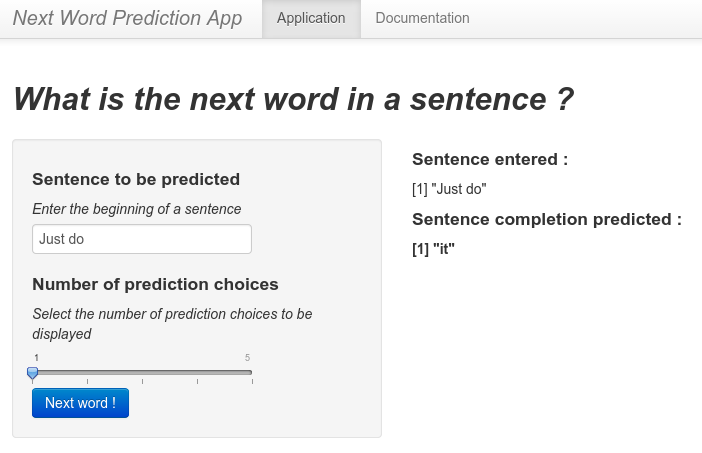

Next Word Prediction App Pitch
========================================================
author: Pierre Paquay
date: Dec. 2014
transition: zoom
css: custom.css

*Coursera Data Science Capstone Project*

Overview
========================================================

The object of this capstone project is to develop a Shiny application to predict the next word in a sentence entered by the end user.

- This project is based on Natural Language Processing (NLP) which is a field of computer science, artificial intelligence, and linguistics concerned with the interactions between computers and human languages.

- More precisely, Word Prediction (WP) involves an algorithm predicting a word (or words) that the user wants to type in without the user actually typing it in.

- This capstone project was designed in collaboration with SwiftKey whose flagship product is a very efficient predictive keyboard for iOS and Android.

The Model
========================================================

The algorithm built for this project is based on the n-grams model with the Markov assumption. In other words, we seek to find the word $w_n$ which maximizes the conditional probability of $w_n$ given its history ($w_{n - k + 1}\cdots w_{n - 1}$ for $k = 2,3,4$). The following steps were used to build this model.

1. Cleaning and processing of a corpora based on three sources : blogs, news feeds and Twitter. To deal with out-of-vocabulary words, we used a &lt;UNK&gt; tag to train the model.

2. Computing of the n-grams probabilities smoothed with the Simple Good-Turing algorithm [[SGT]](http://www.grsampson.net/AGtf1.html).

3. Using the Katz Back-Off recursive procedure [[KBO]](http://www.researchgate.net/publication/221487256_On_enhancing_katz-smoothing_based_back-off_language_model/links/00b7d521ac0d6668f0000000) to take into account lower order n-grams to sort the different predictions in decreasing likelihood.

User Interface
========================================================

- Enter the beginning of a sentence in the text area.

- Use the slider to select the number of prediction choices you wish to display.

- Hit the *"Next Word !"* button to display the sentence completion predicted.
***
*Note that if you choose to display more than one prediction choices, a bar plot of the prediction probabilities will also be displayed.*

Conclusions and Next Steps
========================================================

The prediction accuracy of the model evaluated on an out-of-sample validation set is approximately 20%. This is quite good for a model based only on n-grams, but some improvements may be possible in the near future.

1. Part-of-speech tagging : This process identifies words as nouns, verbs, adjectives, adverbs, etc. And so may help to increase the prediction accuracy as it won't predict a verb following another verb for example.

2. Adaptive learning : This process records input from the user and uses this input to increase the prediction accuracy by enlarging the training dataset with some user-specific data.
